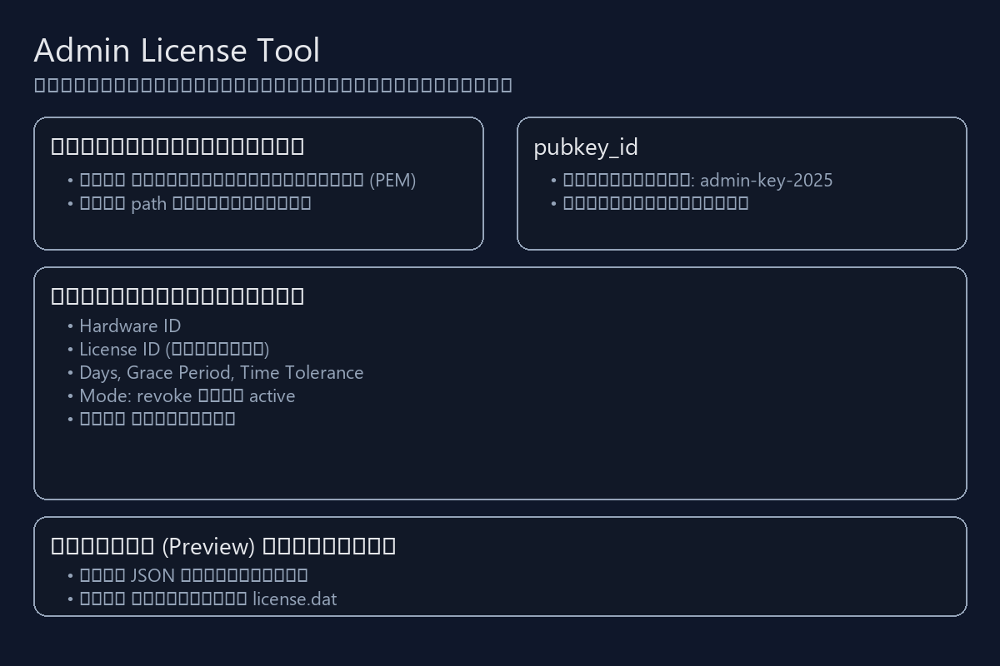
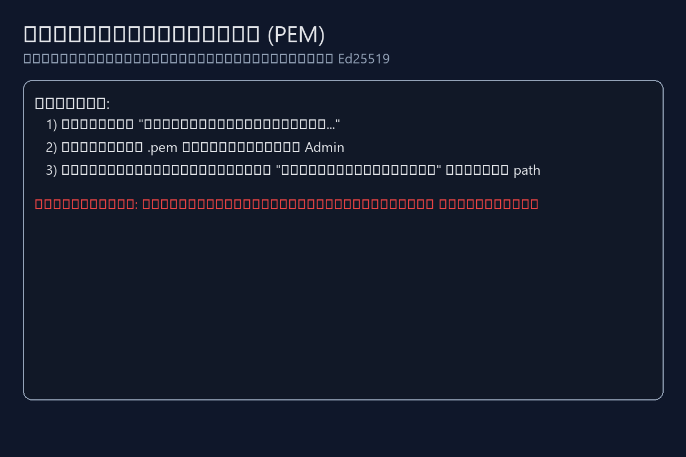
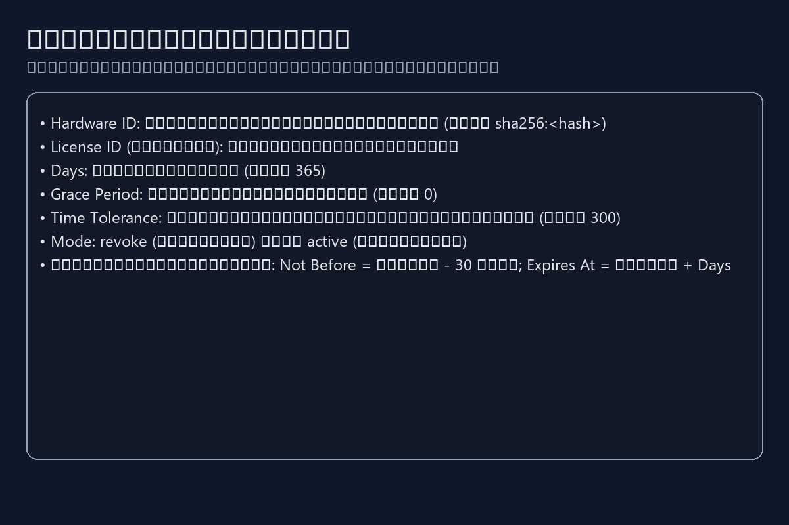
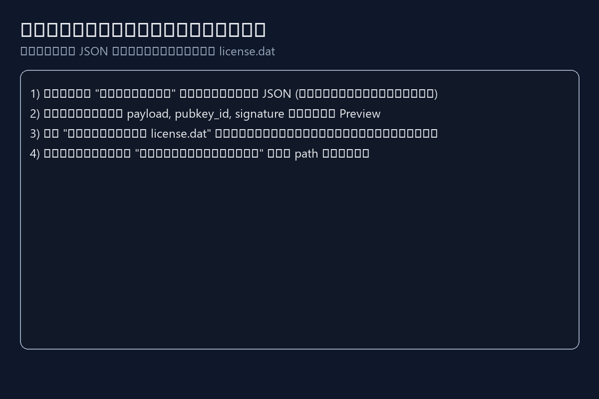
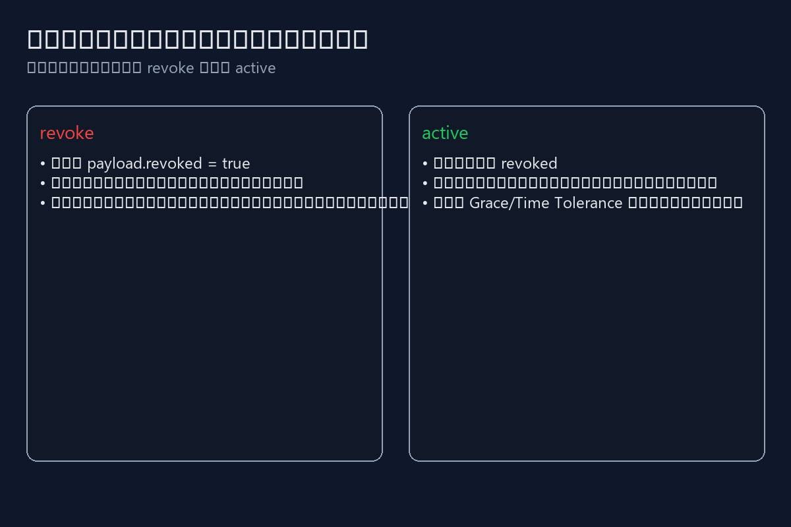
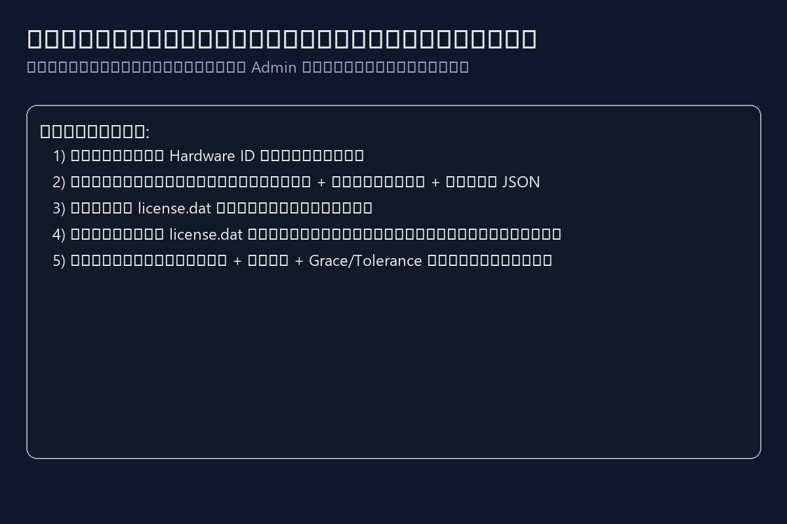

# คู่มือการใช้งาน CNC Costify AI Admin

เวอร์ชัน: 1.3.0  •  ปรับปรุงล่าสุด: 2025-10-16

เครื่องมือผู้ดูแลสำหรับออกและปิดสิทธิ์ใช้งานแบบออฟไลน์ โดยใช้คีย์ส่วนตัว Ed25519 เพื่อสร้างไฟล์ `license.dat` สำหรับส่งให้ลูกค้าใช้งานกับ CNC Costify AI.

---

## สารบัญ (Table of Contents)

หมายเลขหน้าอ้างอิงสำหรับฉบับพิมพ์ (A4, 12pt, ระยะบรรทัด ~1.4):
1. ภาพรวมและข้อกำหนด (หน้า 1)
2. หมวดหมู่หลัก (หน้า 2)
3. หัวข้อย่อย (หน้า 3)
4. ภาพประกอบ (หน้า 4–6)
5. วิธีการใช้งานทีละขั้น (หน้า 7–10)
6. ตัวอย่างการใช้งาน (หน้า 11–12)
7. ดัชนีคำสำคัญ (หน้า 13)

---

## หมวดหมู่หลัก (Main Categories)

- ตั้งค่าและการเตรียมคีย์
- การกรอกแบบฟอร์มไลเซนส์
- การสร้างและพรีวิวผลลัพธ์
- การบันทึกและแจกจ่ายไฟล์
- โหมดการใช้งาน (revoke / active)
- กระบวนการออฟไลน์ระหว่างผู้ดูแลกับลูกค้า

---

## หัวข้อย่อย (Subtopics)

- คีย์ส่วนตัว (PEM) และ `pubkey_id`
- ข้อมูลที่ต้องใช้: `Hardware ID`, `License ID`, `Days`, `Grace`, `Tolerance`
- เวลาที่ระบบคำนวณอัตโนมัติ: `not_before`, `expires_at`
- สถานะและข้อผิดพลาดระหว่างสร้างไฟล์
- การตรวจสอบ JSON ก่อนบันทึก

---

## ภาพประกอบ (Illustrations)

Figure 1 — หน้าต่างหลักและองค์ประกอบสำคัญ  
  
คำอธิบาย: แสดงส่วน “คีย์และการอ้างอิง”, “รายละเอียดไลเซนส์”, “ผลลัพธ์ (Preview) และบันทึก”.

Figure 2 — เลือกคีย์ส่วนตัว (PEM)  
  
คำอธิบาย: ขั้นตอนการเลือกไฟล์ `.pem` และตรวจสอบสถานะโหลดคีย์.

Figure 3 — กรอกแบบฟอร์มไลเซนส์  
  
คำอธิบาย: อธิบายช่องข้อมูลที่ต้องกรอกและโหมดการใช้งาน.

Figure 4 — พรีวิวและบันทึกไฟล์  
  
คำอธิบาย: ตรวจสอบ JSON ที่สร้างและบันทึกออกเป็น `license.dat`.

Figure 5 — เปรียบเทียบโหมด revoke vs active  
  
คำอธิบาย: ความแตกต่างของการปิดสิทธิ์ (revoked) กับการอนุญาตใช้งาน (active).

Figure 6 — กระบวนการออฟไลน์ที่เกี่ยวข้อง  
  
คำอธิบาย: ขั้นตอนระหว่างผู้ดูแลและลูกค้าเพื่อออกใบอนุญาตออฟไลน์.

---

## วิธีการใช้งาน (Step-by-Step Guides)

1) เตรียมคีย์ส่วนตัว (PEM)  
- กดปุ่ม “เลือกไฟล์คีย์ส่วนตัว...” แล้วเลือกไฟล์ `.pem` ของ Admin.  
- ตรวจสอบว่าข้อความสถานะเป็น “โหลดคีย์เรียบร้อย” และมี path แสดง.

2) กำหนด `pubkey_id`  
- ในช่อง `pubkey_id` (ค่าเริ่มต้น `admin-key-2025`) กำหนดรหัสคีย์สาธารณะตามระบบของคุณ.

3) กรอกแบบฟอร์มไลเซนส์  
- `Hardware ID`: ค่าที่เครื่องลูกค้าส่งมา (เช่น `sha256:<hash>`).  
- `License ID` (ทางเลือก): รหัสอ้างอิงใบอนุญาต.  
- `Days`: จำนวนวันใช้งาน (มากกว่า 0).  
- `Grace Period (days)`: วันผ่อนผันหลังหมดอายุ.  
- `Time Tolerance (sec)`: ความคลาดเคลื่อนเวลาที่อนุโลม (วินาที).  
- `Mode`: เลือก `revoke` เพื่อปิดสิทธิ์ หรือ `active` เพื่ออนุมัติใช้งาน.

4) ตรวจสอบการคำนวณเวลาอัตโนมัติ  
- `Not Before` = เวลาปัจจุบัน − 30 นาที (UTC)  
- `Expires At` = เวลาปัจจุบัน + `Days` (UTC)

5) สร้างไฟล์  
- กด “สร้างไฟล์” เพื่อให้ระบบสร้าง JSON และแสดงในช่อง Preview.  
- หากมีข้อผิดพลาด จะมีข้อความสถานะแจ้งเหตุผล.

6) ตรวจสอบ Preview และบันทึก  
- ตรวจสอบค่า `payload`, `pubkey_id`, `signature`.  
- กด “บันทึกเป็น license.dat...” เพื่อเลือกที่จัดเก็บไฟล์.  
- ยืนยันข้อความ “บันทึกเรียบร้อย” และตรวจสอบเส้นทางไฟล์.

คำแนะนำสำคัญ:  
- คีย์ส่วนตัวต้องเก็บอย่างปลอดภัยและไม่เผยแพร่.  
- ตรวจสอบ `Hardware ID` ว่าตรงกับเครื่องลูกค้าเสมอ.  
- ใช้ `Grace` และ `Tolerance` ให้เหมาะกับสภาพแวดล้อมจริง.

---

## ตัวอย่างการใช้งาน (Usage Examples)

กรณีที่ 1: อนุมัติการใช้งาน (active)  
- กรอก `Hardware ID` และตั้ง `Days = 365`, `Grace = 0`, `Tolerance = 300`.  
- เลือกโหมด `active`, กด “สร้างไฟล์”, ตรวจ Preview และบันทึก `license.dat`.  
- ส่งไฟล์ให้ลูกค้า วางในตำแหน่งที่ระบบกำหนด แล้วเปิดใช้งาน.

กรณีที่ 2: ปิดสิทธิ์การใช้งาน (revoke)  
- กรอก `Hardware ID` ที่ต้องการปิดสิทธิ์.  
- เลือกโหมด `revoke`, กด “สร้างไฟล์” และบันทึก `license.dat`.  
- แจ้งลูกค้าให้อัปเดตไฟล์ใบอนุญาต ระบบจะตรวจพบ `revoked = true` และปิดสิทธิ์.

เปรียบเทียบก่อน–หลัง:  
- ก่อน: ลูกค้ายังไม่มีไฟล์หรือไฟล์หมดอายุ/ถูกปิดสิทธิ์.  
- หลัง: ลูกค้าวางไฟล์ `license.dat` ที่ออกใหม่ ระบบอนุมัติตามเงื่อนไขที่กำหนด.

---

## ดัชนี (Index)

- Active — หน้า 11  
- Ed25519 — หน้า 1  
- Grace Period — หน้า 7  
- Hardware ID — หน้า 7  
- License ID — หน้า 7  
- Preview — หน้า 8  
- Revoked — หน้า 12  
- Signature — หน้า 8  
- Time Tolerance — หน้า 7  
- `license.dat` — หน้า 8

---

หมายเหตุการนำเสนอและการพิมพ์:  
- ใช้ฟอนต์อ่านง่าย น้ำหนักสม่ำเสมอ และเว้นพื้นที่ว่างเหมาะสม.  
- หากต้องการเลขหน้าแนบแน่นอน ให้แปลงเอกสารนี้เป็น PDF โดยตั้งค่าหน้ากระดาษ A4, ฟอนต์ 12pt, ระยะบรรทัด 1.4.  
- รูปภาพทั้งหมดอยู่ใน `assets/manual/admin/` สามารถปรับแก้หรือเพิ่มรูปจากหน้าจอจริงได้ตามต้องการ.